<h1 align="center">Mudabbir Ahmad</h1>

  Graduate software engineer in London, UK 
  BSc Computer Science (First Class Honours), Kingston University

  
  
  

  <a href="https://mudabbir.tech">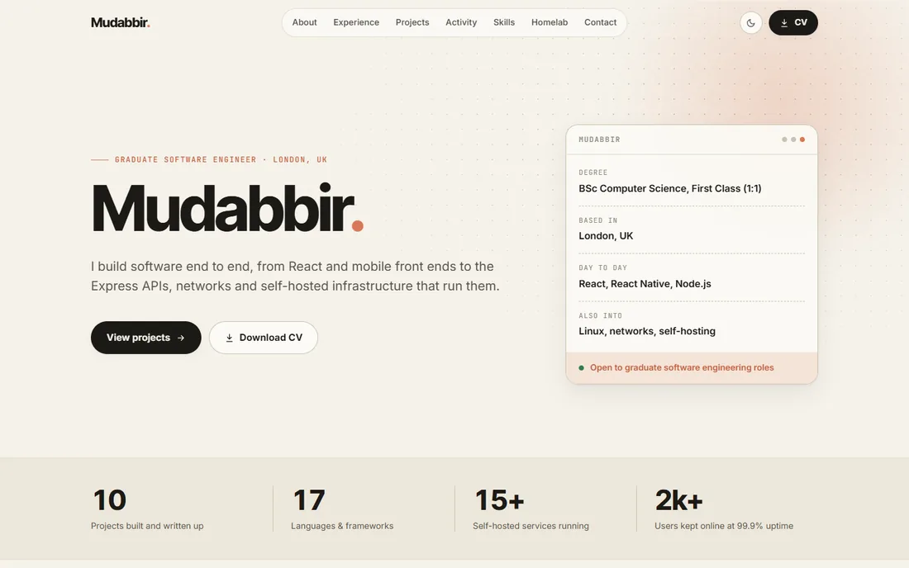</a>

---

I graduated in July 2026 and I'm looking for my first full-time software engineering role. I like owning a problem from the first sketch through to something that is actually running somewhere, whether that's a React Native app, the Express API behind it, or the server it's deployed on.

My day-to-day stack is **React, React Native and Node.js**, with a lot of **Java** from university. I'm currently learning **C++** and **Go** properly. Outside of coding I run a Proxmox homelab with around 15 self-hosted services, and I've spent every summer since 2020 volunteering as a network engineer at a large multi-site event.

## Tech

<table>
  <tr>
    <td width="170"><b>Languages</b></td>
    <td></td>
  </tr>
  <tr>
    <td><b>Learning</b></td>
    <td></td>
  </tr>
  <tr>
    <td><b>Front end and mobile</b></td>
    <td>  </td>
  </tr>
  <tr>
    <td><b>Back end and testing</b></td>
    <td></td>
  </tr>
  <tr>
    <td><b>Infrastructure</b></td>
    <td>  </td>
  </tr>
  <tr>
    <td><b>Tools</b></td>
    <td></td>
  </tr>
</table>

## Selected projects

<table>
  <tr>
    <td width="360" align="center" valign="middle">
      <a href="https://github.com/mudabbir-ahmad/Abstracted-MASS-PublicVer">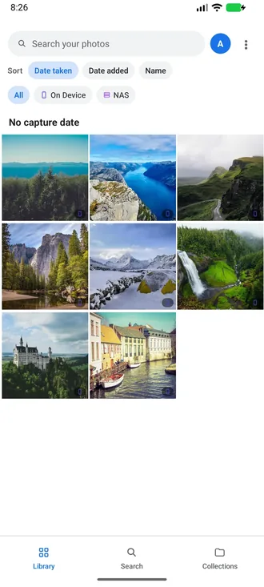</a>
      <a href="https://github.com/mudabbir-ahmad/Abstracted-MASS-PublicVer">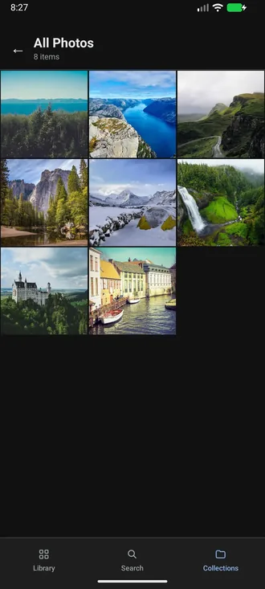</a>
      <a href="https://github.com/mudabbir-ahmad/Abstracted-MASS-PublicVer">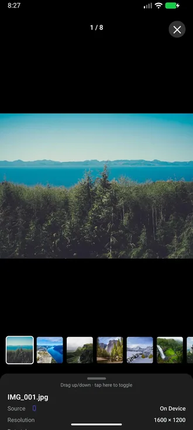</a>
    </td>
    <td valign="top">
      <b><a href="https://github.com/mudabbir-ahmad/Abstracted-MASS-PublicVer">MASS: Media Aggregation &amp; Sorting System</a></b> 
      Final-year project. A cross-platform app that merges device storage, Google Photos and a home NAS into one timeline. Response caching in the Express API cut retrieval latency by around 30%, and a CI/CD pipeline cut integration time by around 20%.  
      
      
      
      
    </td>
  </tr>
  <tr>
    <td align="center" valign="middle">
      <a href="https://github.com/mudabbir-ahmad/MAD-Treasure-Hunt">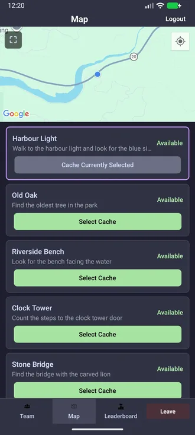</a>
      <a href="https://github.com/mudabbir-ahmad/MAD-Treasure-Hunt">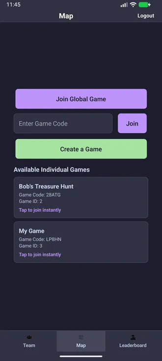</a>
    </td>
    <td valign="top">
      <b><a href="https://github.com/mudabbir-ahmad/MAD-Treasure-Hunt">Location-Based Treasure Hunt</a></b> 
      A GPS and compass driven mobile game. Players get live bearing and distance to hidden caches. The REST backend reached 90% unit-test coverage.  
      
      
      
    </td>
  </tr>
  <tr>
    <td align="center" valign="middle">
      <a href="https://github.com/mudabbir-ahmad/Kotlin-TB2P1">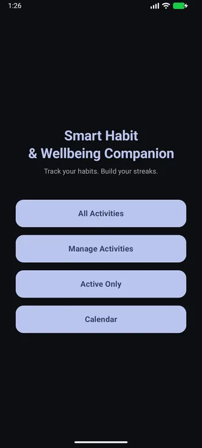</a>
    </td>
    <td valign="top">
      <b><a href="https://github.com/mudabbir-ahmad/Kotlin-TB2P1">Routines</a></b> 
      A native Android habit tracker with offline-first storage and scheduled reminders.  
      
      
      
      
    </td>
  </tr>
  <tr>
    <td align="center" valign="middle">
      <a href="https://github.com/mudabbir-ahmad/Treasure-Hunt-App">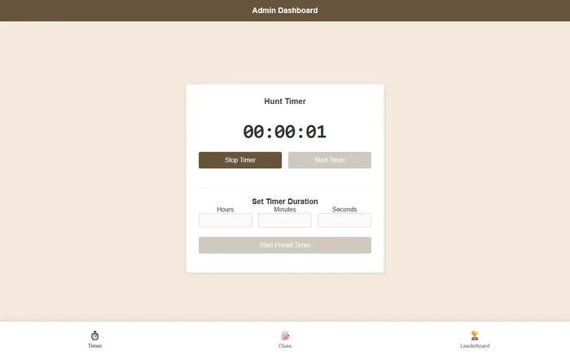</a>
    </td>
    <td valign="top">
      <b><a href="https://github.com/mudabbir-ahmad/Treasure-Hunt-App">QR Code Treasure Hunt</a></b> 
      A group project: a web scavenger hunt with QR code generation, server-side scan validation and a live leaderboard.  
      
      
    </td>
  </tr>
  <tr>
    <td align="center" valign="middle">
      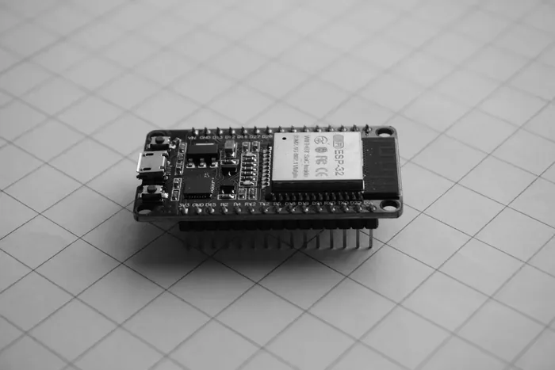
    </td>
    <td valign="top">
      <b>240 GHz Doppler Radar</b> 
      An ESP32 reads raw radar data in real time to track three moving targets and streams the results to a web dashboard over Wi-Fi.  
      
      
    </td>
  </tr>
  <tr>
    <td align="center" valign="middle">
      <a href="https://mudabbir.tech">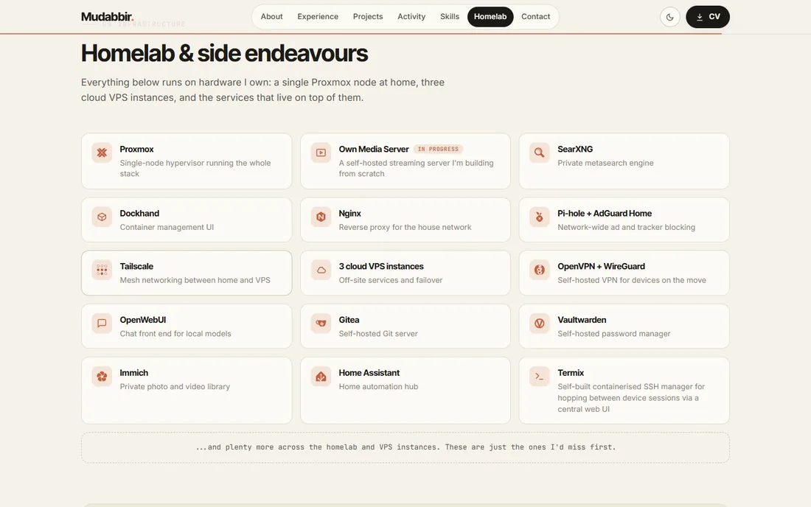</a>
    </td>
    <td valign="top">
      <b><a href="https://mudabbir.tech">Portfolio</a></b> 
      My portfolio site, with a live GitHub activity feed served by an Express endpoint that caches the GraphQL API and keeps the token server-side. Ships as a non-root multi-stage Docker image.  
      
      
      
      
    </td>
  </tr>
</table>

I also keep a small [Opera GX style sidebar for Floorp](https://github.com/mudabbir-ahmad/Opera-GX-Styled-Floorp-Sidebar), a CSS tweak that floats the sidebar over the page instead of tiling it.

## 💻 Working Environment & Infrastructure

  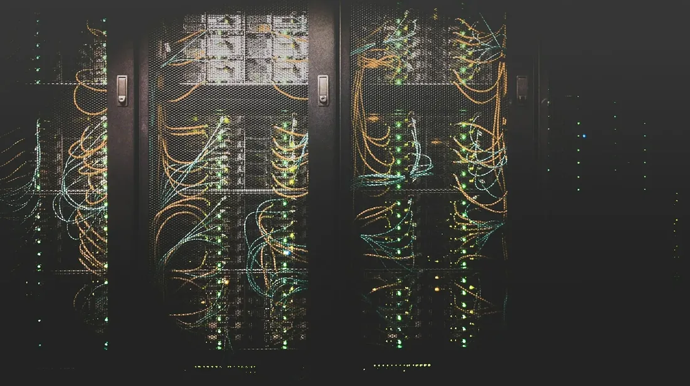

A single Proxmox host behind an Nginx reverse proxy, with Tailscale, WireGuard and OpenVPN for remote access, plus a few cloud VPS instances for off-site services. I do my day-to-day work on a Windows 11 desktop and a Mac.

  <b>Platform and networking</b> 
  
  
  
  
  
  
  
  

  <b>Self-hosted services</b> 
  
  
  
  
  

  <b>Local AI</b> 
  
  
  
  

I also run language models locally to learn how inference and serving work, and I use them in a Python Discord bot that talks in text channels and voice calls, with a cloud model and a local fallback.

## Get in touch

I'm open to graduate software engineering roles. The quickest way to reach me is by [email](mailto:mudabbira.uk@gmail.com) or on [LinkedIn](https://www.linkedin.com/in/mudabbir-ahmad-4245a0281/), and my CV is available on [my portfolio](https://mudabbir.tech).
